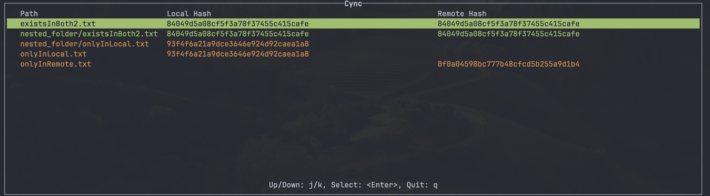

# Cync

A terminal-based user interface for hosting files on S3 with seamless file synchronization capabilities.

Supports bi-directional sync without versioning.


## Installation

`cync` is available on [crates.io](https://crates.io/crates/cync) and on homebrew.

To install from crates.io:

```
cargo install cync
```

To install from homebrew

```
brew tap juicedrinker/cync
brew install cync
```

## Dependencies

- [AWS CLI](https://docs.aws.amazon.com/cli/latest/userguide/cli-chap-welcome.html)
- Configure [AWS SSO](https://docs.aws.amazon.com/cli/latest/userguide/cli-configure-sso.html)

## Usage

- Run `cync init` to run the setup wizard the first time
- Run `cync` to run TUI

## Roadmap
- Be able to pull nested folders from remote directory
- Add extra CLI commands to print local and remote directory paths
- Terminal restoration on panics
- Improve Setup wizard
- Improve error reporting
- Add loader for long-running tasks
